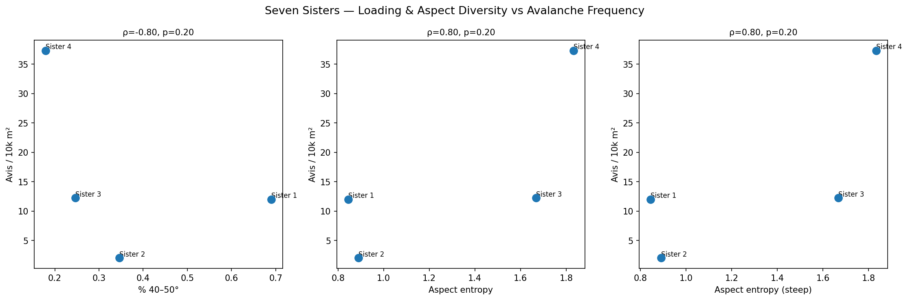
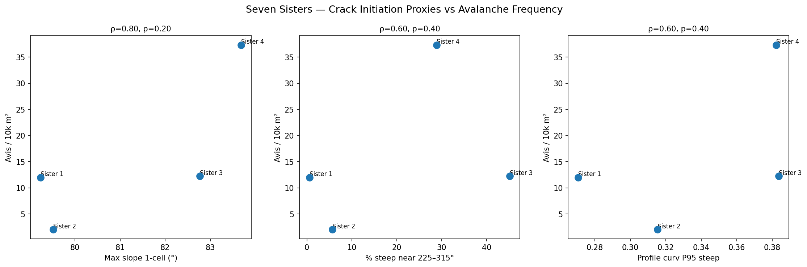
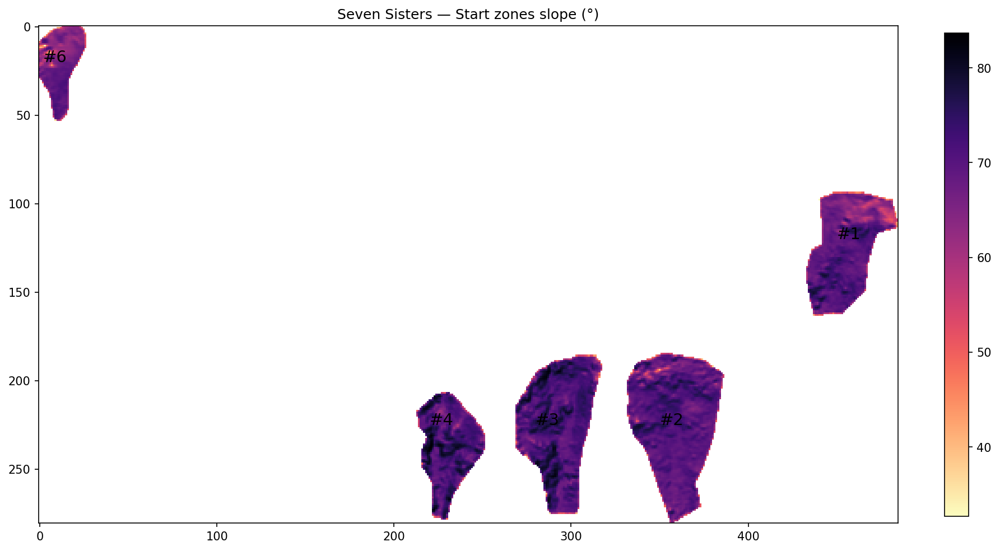
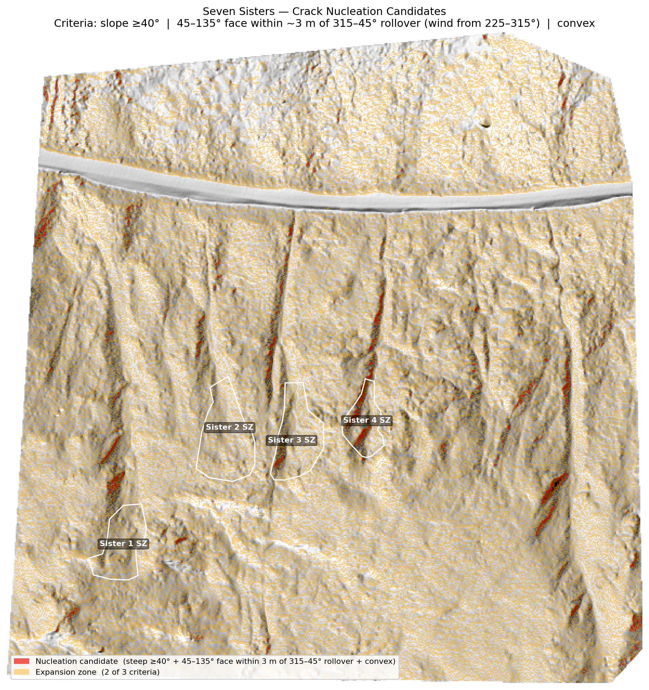
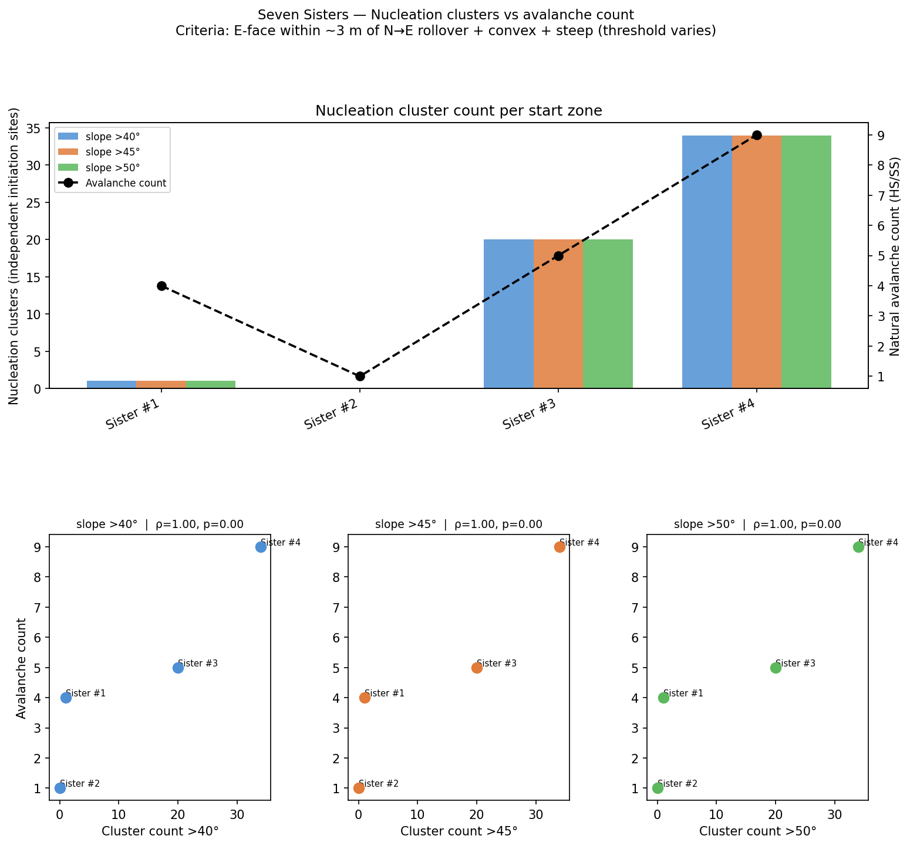
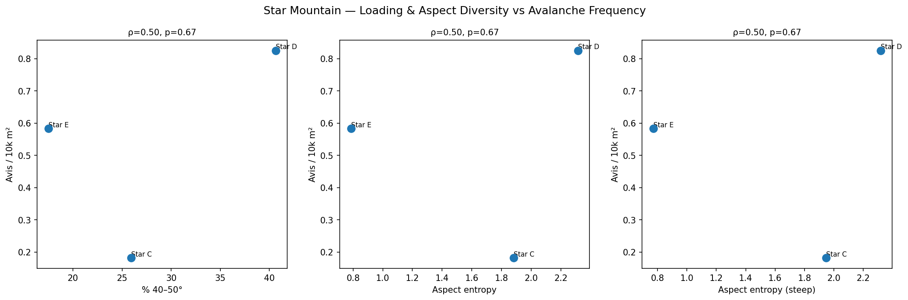
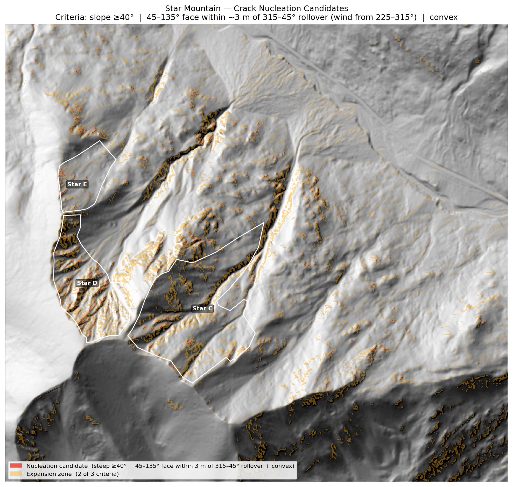
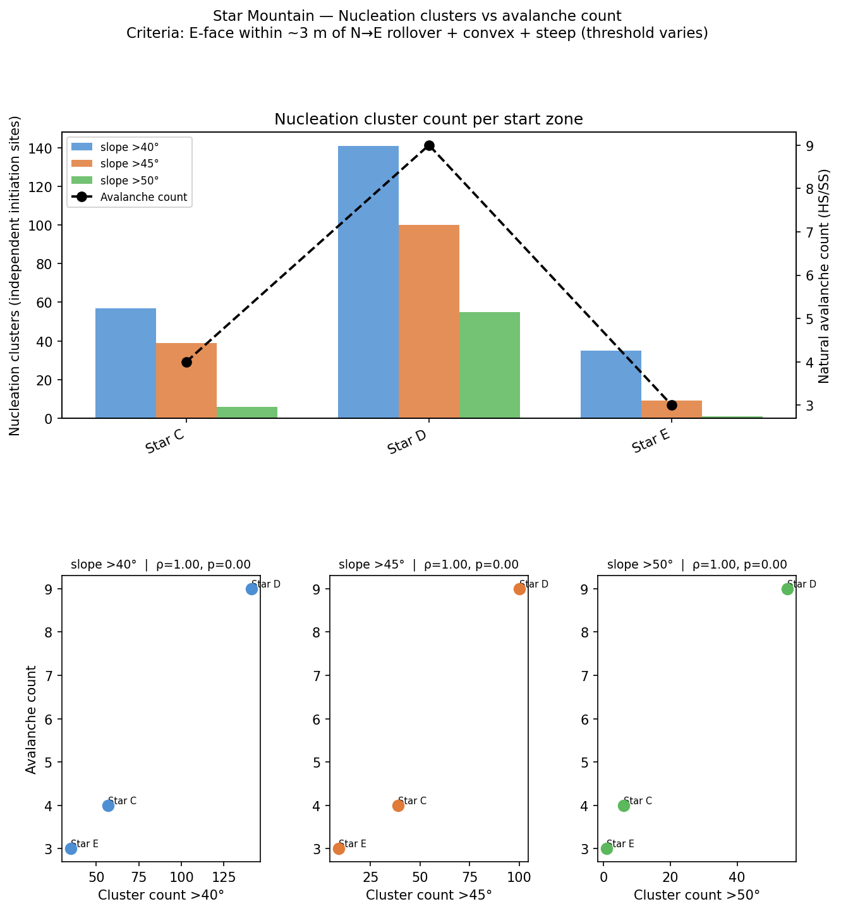

# Terrain-Based Prediction of Natural Avalanche Frequency in Highway Start Zones
### Seven Sisters and Star Mountain Preliminary Results

---

## 1. Motivation

Natural slab avalanches on mountain highway corridors represent a persistent hazard to road users and maintenance crews. While all avalanche start zones on a given corridor share the same regional snowpack and storm exposure, some paths release naturally far more often than others. Understanding *why* and how terrain geometry affects the frequency of these avalanches can improve hazard forecasting, prioritization of mitigation works, and the physical interpretation of avalanche climate data.

The central question this work addresses is:

> Given two start zones on the same mountain, both already steep enough to release a slab, what terrain features explain why one releases significantly more often than the other?

The answer is not simply "steeper terrain." All zones studied here are pre-selected avalanche terrain with mean slopes well above the 35° slab-release threshold. What distinguishes high- from low-frequency zones must therefore lie in features that control either snow accumulation (loading) or fracture initiation mechanics, or the spatial coincidence of both.

This work tests three physically motivated hypotheses:

1. **Aspect diversity hypothesis.** Start zones whose steep terrain faces multiple directions accumulate wind slabs from multiple storm tracks, increasing total loading and the probability of natural release.
2. **Stress concentration hypothesis.** Convex terrain rolls concentrate the normal stress at the base of a slab in the same way a notch tip concentrates mode-I stress intensity (K_I) in fracture mechanics. Zones with more extreme convexity should initiate fractures more readily.
3. **Co-occurrence hypothesis.** Neither loading nor steepness alone is sufficient for release; the spatial coincidence of loaded terrain with steep terrain within the same zone amplifies risk.

---

## 2. Study Sites

Both sites are along US-550 (the Million Dollar Highway) in the San Juan Mountains of Colorado, a corridor with one of the highest natural avalanche frequencies in North America. Prevailing storm winds arrive from the W–NW (225–315°).

| Site | Start zones analysed | Excluded | Record |
|---|---|---|---|
| **Seven Sisters** | #1, #2, #3, #4 | #6 (wind-scoured convex ridge, different regime) | CAIC 2009–2021 |
| **Star Mountain** | C, D, E | A, B (different loading pattern) | CAIC 2009–2021 |

Only natural hard-slab (HS) and soft-slab (SS) avalanches are used. Human-triggered events are excluded to isolate terrain-controlled release. Avalanche frequency is expressed both as raw count and normalised by start-zone area (events per 10,000 m²) to remove the trivial size effect.

---

## 3. Data

### 3.1 LiDAR-derived DEMs

High-resolution DEMs were derived from USGS 3DEP airborne LiDAR:

- **Seven Sisters:** 1.2 m/pixel, NAD83 / UTM zone 13N
- **Star Mountain:** 1.0 m/pixel, NAD83 / UTM zone 13N

Processing pipeline (PDAL):

1. Merge raw LAZ tiles
2. Optional spatial crop to site extent
3. SMRF ground segmentation (slope 1.7, window 16 m, threshold 0.45 m) with ELM noise removal and outlier filtering
4. Ground returns → mean-elevation GeoTIFF

At sub-metre resolution, individual convex rolls and slope breaks (the most relevant terrain features to snow loading and slab mechanics) are fully resolved. Coarser 10 m DEMs smooth away these features entirely.

### 3.2 Start-zone polygons

Start-zone boundaries were digitised by hand against ortho imagery and stored as KML files. Each zone boundary was clipped from the full-site DEM to produce a per-zone terrain dataset. Terrain attributes (slope, aspect, profile curvature) were computed on the per-zone DEMs using GDAL DEMProcessing and the Evans–Young central-difference formula for profile curvature.

### 3.3 Avalanche records

Colorado Avalanche Information Center (CAIC) highway observer database, 2009–2021. Records were filtered to natural trigger (N) and slab types (HS, SS). Sister #6 records were additionally filtered to above-treeline elevation only to exclude runouts misattributed to the start zone.

---

## 4. Terrain Metrics

All metrics are computed per start zone from the clipped DEM.

| Metric | Description |
|---|---|
| `pct_40_50` | % of cells with slope 40–50° (core slab release band) |
| `slope_max_1cell` | Max slope of any single ~1.4 m² cell — proxy for peak driving stress |
| `aspect_entropy` | Shannon entropy (bits) of aspect over 8 octants, all cells |
| `aspect_entropy_steep` | Same, restricted to cells ≥ 35° — loading diversity of release terrain |
| `pct_steep_near_loading` | % of cells that are steep (≥40°) AND within ~2.4 m of a W–NW (225–315°) facing cell |
| `profile_curv_p95_steep` | 95th-percentile profile curvature on steep interior cells (boundary pixels excluded) |

Aspect entropy is computed over 8 equally spaced compass octants (0 = unimodal, 3 bits = fully uniform). Shannon entropy is used rather than circular variance because it captures the *number of distinct loading directions*, not just the spread from a mean.

Profile curvature follows the sign convention of Gvirtzman et al. (2025): **positive = convex** (terrain bends away from the viewer looking downslope). Positive curvature concentrates normal stress at the slab base, lowering the energy required to initiate a mode-II crack.

---

## 5. Results — Seven Sisters

### 5.1 Avalanche record

| Path | Natural HS/SS (2009–2021) | Events / 10,000 m² |
|---|---|---|
| Sister #1 | 4 | 12.0 |
| Sister #2 | 1 | 2.0 |
| Sister #3 | 5 | 12.2 |
| Sister #4 | 9 | 37.3 |
| Sister #6 | 1 | — (excluded) |

Sister #4 is the most active path by a large margin on a per-area basis (37.3 events / 10,000 m²), followed by #3 and #1.

### 5.2 Terrain metrics

| Zone | % 40–50° | Max slope (°) | Aspect entropy | Aspect entropy (steep) | % steep near loading | Curv P95 steep | Area (m²) |
|---|---|---|---|---|---|---|---|
| Sister #1 | 0.69 | 79.2 | 0.845 | 0.845 | 0.56 | 0.271 | 3,339 |
| Sister #2 | 0.35 | 79.5 | 0.890 | 0.890 | 5.66 | 0.315 | 4,991 |
| Sister #3 | 0.25 | 82.8 | 1.668 | 1.668 | 45.19 | 0.384 | 4,085 |
| Sister #4 | 0.18 | 83.7 | 1.833 | 1.833 | 28.85 | 0.382 | 2,411 |

Sisters #3 and #4 have strikingly higher aspect entropy than #1 and #2, reflecting more complex terrain that faces multiple loading directions.

### 5.3 Correlations with avalanche frequency

| Metric | Spearman ρ | Kendall τ |
|---|---|---|
| % 40–50° | −0.80 | −0.67 |
| Max slope 1-cell | +0.80 | +0.67 |
| Aspect entropy | +0.80 | +0.67 |
| **Aspect entropy (steep)** | **+0.80** | **+0.67** |
| % steep near loading | +0.60 | +0.33 |
| Profile curv P95 (steep) | +0.60 | +0.33 |

*N = 4. All p-values are exploratory.*

**Aspect entropy** (all cells and steep-only) and **max slope of the steepest single cell** are the strongest predictors (ρ = +0.80). Notably, the fraction of terrain in the 40–50° release band has a *negative* correlation (ρ = −0.80): high-frequency zones have relatively less terrain concentrated in the 40–50° range but more extreme local maxima and more diverse aspect distribution.

*Figure 1. Scatter plots of the three strongest terrain predictors against avalanche frequency (Seven Sisters). Each point is one start zone. ρ values are Spearman rank correlations.*   

*Figure 2. Max slope 1-cell, loading co-occurrence, and profile curvature P95 against avalanche frequency (Seven Sisters).*

### 5.4 Start-zone slope map

*Figure 3. Slope angle of the combined Seven Sisters start-zone DEM. Sisters #3 and #4 (right) show a more complex mix of slope angles and aspects than #1 and #2 (left).*

### 5.5 Nucleation candidate map

*Figure 4. Likely crack nucleation candidates (red) and expansion-zone candidates (orange) on the Seven Sisters hillshade. Criteria: slope ≥40°, E-facing terrain within ~3 m of the N→E aspect rollover (wind-deposited lee face), and positive profile curvature. White outlines show start-zone boundaries.*

### 5.6 Nucleation clusters vs. avalanche count

*Figure 5. Number of spatially connected nucleation-candidate clusters per start zone (bars, split by slope threshold) against raw natural avalanche count (line). Sister #4 has the most clusters and the highest avalanche count. Note that Sister One has a relatively high number of avalanches for nucleation points. This can be explained by the nucleation points along the path outside its start zone polygon (Figure 4). In fact, the vast majority of the natural slab avalanches from Sister One originated from this area.*

---

## 6. Results — Star Mountain

### 6.1 Avalanche record

| Path | Natural HS/SS (2009–2021) | Events / 10,000 m² |
|---|---|---|
| Star C | 4 | 0.18 |
| Star D | 9 | 0.83 |
| Star E | 3 | 0.58 |
| Star A | 4 | — (excluded) |
| Star B | 9 | — (excluded) |

Star D is the highest-frequency analysed path. Star A and B are excluded because their different loading pattern (wind-exposed rather than lee-loaded geometry) makes them not directly comparable to C, D, and E.

### 6.2 Terrain metrics

| Zone | % 40–50° | Max slope (°) | Aspect entropy | Aspect entropy (steep) | % steep near loading | Curv P95 steep | Area (m²) |
|---|---|---|---|---|---|---|---|
| Star C | 25.93 | 82.5 | 1.881 | 1.948 | 2.56 | 0.762 | 220,056 |
| Star D | 40.64 | 81.8 | 2.316 | 2.318 | 13.35 | 0.756 | 109,055 |
| Star E | 17.51 | 71.7 | 0.786 | 0.773 | 0.00 | 0.747 | 51,435 |

Star D has the highest aspect entropy (2.32 bits) and the highest proportion of terrain in the 40–50° release band (40.6%), consistent with its status as the most active analysed path.

### 6.3 Correlations with avalanche frequency

| Metric | Spearman ρ | Kendall τ |
|---|---|---|
| % 40–50° | +0.50 | +0.33 |
| Max slope 1-cell | −0.50 | −0.33 |
| Aspect entropy | +0.50 | +0.33 |
| **Aspect entropy (steep)** | **+0.50** | **+0.33** |
| % steep near loading | +0.50 | +0.33 |
| Profile curv P95 (steep) | −0.50 | −0.33 |

*N = 3. All p-values are exploratory.*

With only three comparable zones the correlations are weak and underpowered. The direction of the aspect entropy signal (ρ = +0.50) is consistent with Seven Sisters, but profile curvature shows the opposite sign here (ρ = −0.50). This may reflect that Star Mountain's large, complex start zones are not well characterised by a single curvature percentile.

*Figure 6. Terrain predictors vs. avalanche frequency (Star Mountain). N = 3; correlations are exploratory.*

### 6.4 Nucleation candidate map

*Figure 7. Nucleation candidates (red) and expansion zones (orange) on the Star Mountain hillshade. The loading geometry is the same W–NW wind source, E-facing lee-slope criterion as Seven Sisters.*

### 6.5 Nucleation clusters vs. avalanche count

*Figure 8. Nucleation cluster count vs. raw avalanche count (Star Mountain, C/D/E only).*

---

## 7. Cross-site synthesis

Despite the small sample sizes, two patterns are consistent across both sites:

**1. Aspect entropy of steep terrain is the most consistent positive predictor.**  
At Seven Sisters (ρ = +0.80) and Star Mountain (ρ = +0.50), zones with more diverse aspect distributions on their steep terrain have higher avalanche frequency. This is consistent with the wind-loading hypothesis: multi-directional steep faces collect wind slabs from more storm tracks, accumulating heavier and more variable loading conditions.

**2. Raw steepness within the 40–50° band is not a reliable discriminator.**  
At Seven Sisters, % 40–50° has ρ = −0.80 (the highest-frequency zones are those with *less* terrain concentrated in this band, and more extreme local slope maxima). At Star Mountain, the signal is weakly positive but non-significant. This is expected: all zones were pre-selected as slab terrain. What matters is not the fraction of release-angle terrain but the geometry that drives loading and fracture initiation.

**3. Profile curvature gives mixed results.**  
The positive signal at Seven Sisters (ρ = +0.60) is physically intuitive — convex rolls concentrate stress — but the signal reverses at Star Mountain (ρ = −0.50). The Star Mountain start zones are an order of magnitude larger than the Sisters zones (50,000–220,000 m² vs. 2,400–5,000 m²), and a single P95 value may not adequately capture the distribution of convexity in such large, complex terrain.

---

## 8. Nucleation site analysis

For each site, likely crack initiation locations were identified by the simultaneous occurrence of three criteria on the full-area DEM:

1. **Slope ≥ 40°:** sufficient driving shear stress
2. **Lee face within ~3 m of the source-face rollover:** wind-deposited slab geometry (Seven Sisters: E-facing terrain within ~3 m of a N-facing ridge cap; Star Mountain: same geometry)
3. **Positive profile curvature:** stress-concentration geometry

Spatially connected patches meeting all three criteria are treated as independent nucleation candidates (Figure 4, Figure 7). The count of these clusters at three slope thresholds (>40°, >45°, >50°) is compared with the observed avalanche count (Figures 5, 8).

At Seven Sisters, Sister #4 has both the largest number of nucleation clusters and the highest avalanche count, supporting the hypothesis that terrain geometry controls natural release frequency. At Star Mountain, the pattern is less clear with only three comparable zones.

---

## 9. Limitations

- **Sample size.** N = 4 (Sisters) and N = 3 (Star Mountain) are too small for meaningful statistical inference. Effect sizes are reported as exploratory. Bootstrap CIs are not computable at these sample sizes.
- **Avalanche record completeness.** The CAIC highway observer record reflects patrol conditions and visibility as well as actual avalanche activity. Small, non-road-impacting events may be systematically under-reported for some paths.
- **Co-occurrence proxy.** Aspect entropy and `pct_steep_near_loading` are computed independently across all cells. A zone can score high on both without the loaded and steep cells coinciding spatially. Definitive co-occurrence analysis requires mapping wind-slab deposition directly onto the terrain.
- **Profile curvature sensitivity.** The P95 metric on interior cells is sensitive to DEM noise at short wavelengths. Results may change with DEM smoothing or alternative curvature estimators.
- **Nucleation criterion geometry.** The N→E rollover criterion was derived from the Seven Sisters geometry. Star Mountain and US-550 may require site-specific aspect ranges for the nucleation analysis to be physically meaningful.

---

## 10. Next steps

1. **Complete the US-550 analysis** (Eagle, Muleshoe, Porcupine, Telescope) to bring the combined N to ~11 across three sites — enough for preliminary cross-site regression.
2. **Weight aspect entropy by prevailing wind frequency** for the Silverton area to make the loading proxy more physically grounded.
3. **Map snow depth variability** from repeat LiDAR or GPR onto slope and aspect rasters to directly measure co-occurrence of wind-slab deposition and high-shear-stress terrain.
4. **Refine the nucleation site criterion** using known release locations from observer photos or remote camera data to validate and calibrate the three-criterion mask.
5. **Test profile curvature at multiple spatial scales** — the current 1–1.2 m resolution captures small-scale rolls; smoothed DEMs at 3–5 m may better represent the slab-scale stress geometry.

---

## References

- Gvirtzman, S. et al. (2025). Detection of likely shear initiation location for dry-snow slab avalanches. *Nature*, https://doi.org/10.1038/s41586-024-08287-y
- Pingel, T. J., Clarke, K. C., & McBride, W. A. (2013). An improved simple morphological filter for the terrain classification of airborne LIDAR data. *ISPRS Journal of Photogrammetry and Remote Sensing*, 77, 21–30.
- Colorado Avalanche Information Center (CAIC) highway observer database, 2009–2021.
- USGS 3D Elevation Program (3DEP) LiDAR data.
